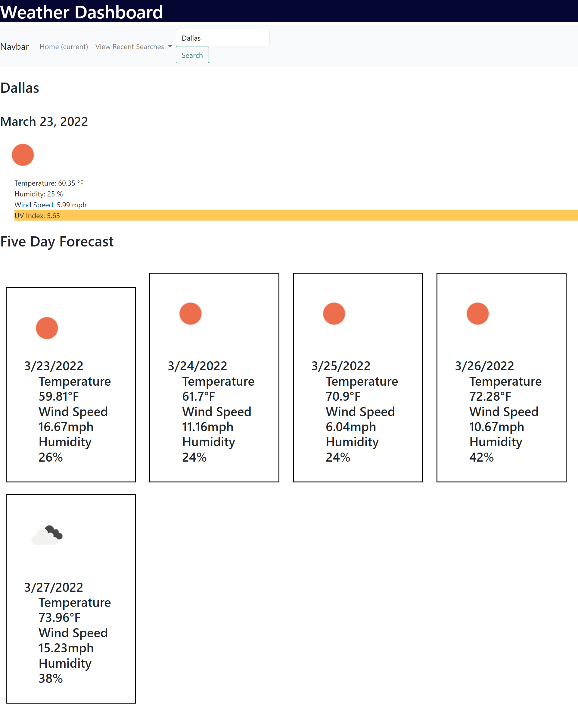

# weather-dashboard

## Objectives

In this project, I utilized APIs to create an interactive Weather Dashboard where the user can input a city and view the weather for the next 5 days. 

For each day, you should see the corresponding date, and icon representing the weather conditions, the temperature, the wind speed and the humidity. On the first day you also receive the additional information of the UV Index and that line is coded so that the background color changes based on the severity.

## Screenshot

## Website

## Contributions

The APIs that I used for this project were Moment.js and OneWeather.

I utilized Bootstrap to quickly come up with a cohesive website and JQuery to make coding easier.

I referenced this  to gather more information on the UV index scale.

I also used this  on Stack Overflow for help in dynamically appending the data.